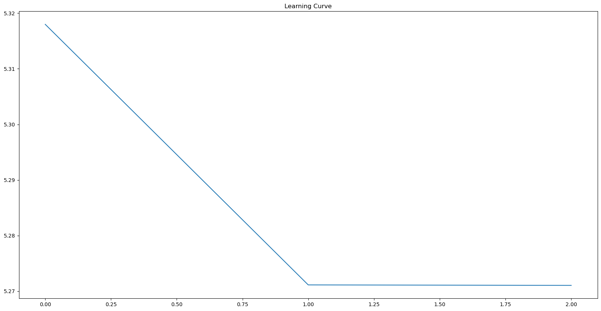
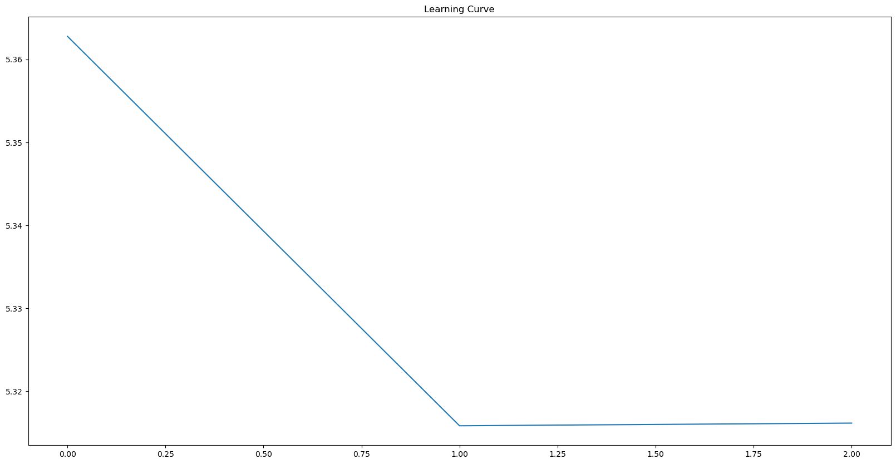
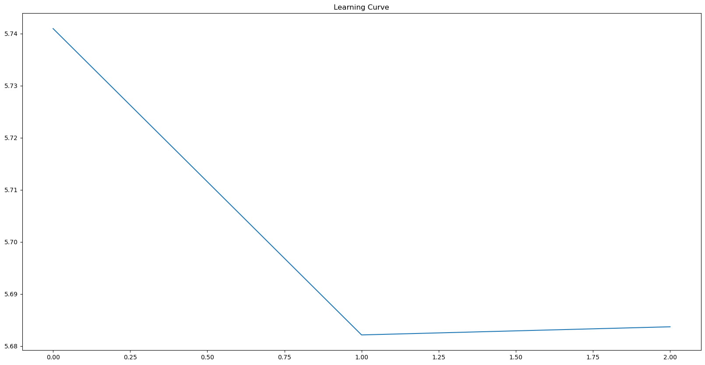
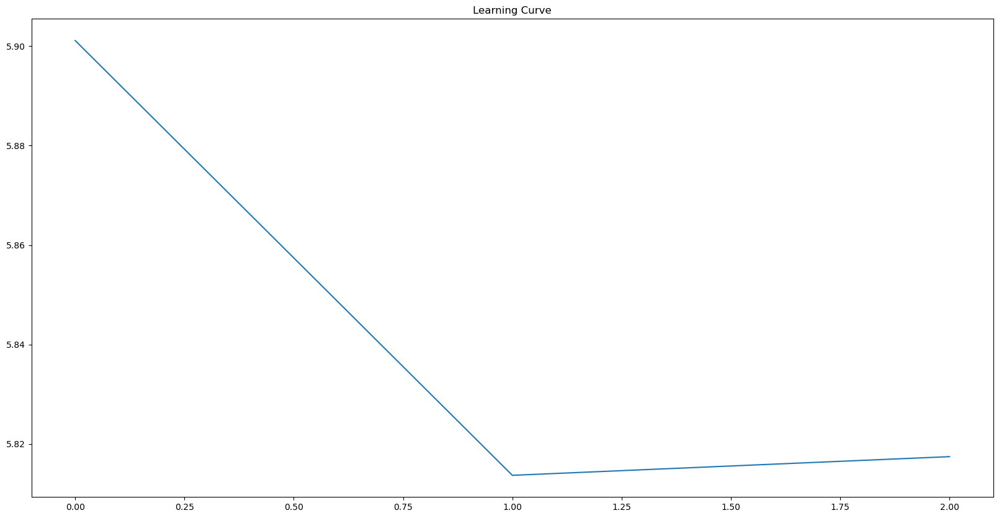
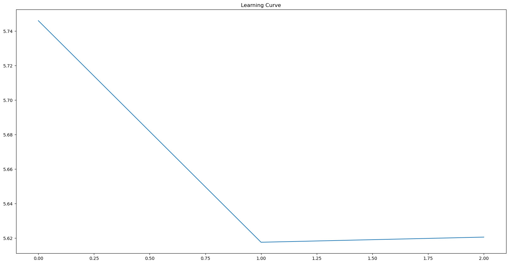

# Self-trained philosophical word2vec embeddings

## ...obtained out of Hegel's and Kant's corpora.

This project is a part of the means of assessment for the mandatory course 
"Machine Learning for Natural Language Understanding" of my NLP master's degree
program at Trier University in the winter semester 22/23. 

## Main Tasks:
1. From-scratch implementation of Skip-Gram architecture: *from raw .txt files to embeddings*

2. Comparison of embeddings' similarity of the most frequently encountered
philosophical concepts in the corpora of Hegel and Kant (one language, two
philosophers)

3. Comparison of similarity of English and German embeddings for the same
philosopher i.e. corpora (two languages, one philosopher)

## Corpora:
The texts of great German philosophers Hegel and Kant were chosen as the
corpora for training the model, namely:

* Kant, Kritik der reinen Vernunft, 1787
* Kant, Kritik der Urteilskraft, 1790
* Hegel, Phänomenologie des Geistes, 1807
* Hegel, Wissenschaft der Logik (Enzyklopädie), 1830

All four texts are taken both in 
German and in English (from [gutenberg.org](https://www.gutenberg.org/)), so that the first two build Kant’s 
corpora (`DE_KANT_CORPUS.txt`, `ENG_KANT_CORPUS.txt`) and the other two Hegel’s ones 
(`DE_HEGEL_CORPUS.txt`, `ENG_HEGEL_CORPUS.txt`).

## Outcomes and Inferences

### Task 1
[Top-k-accuracy](https://pytorch.org/docs/stable/generated/torch.topk.html) (with k = 9) was used for model evaluation.

#### Check the results here:

  
<b><i>Window size = 3, stop words included.</i></b>
  
    

Hegel. English corpora.
  
        

            
            <i>X-axis: epochs. Y-axis: loss. </i>  
            <code>The number of tokens with stop words is: 362327   model_type: skipgram  
n_epochs: 3  
learning process:  
epoch #0   : 5.31799  
epoch #1   : 5.27113  
epoch #2   : 5.27104  
top_k_accuracy: 38.1010 %  </code>
        

    

     
    

Hegel. German corpora.

        

            
            <i>X-axis: epochs. Y-axis: loss.</i>    
            <code>The number of tokens with stop words is: 467522         
model_type: skipgram  
n_epochs: 3               
learning process:            
epoch #0   : 5.65144  
epoch #1   : 5.61443  
epoch #2   : 5.61461           
top_k_accuracy: 31.6584 %  </code>
        

    

     
    

Kant. English corpora.

        

            
            <i>X-axis: epochs. Y-axis: loss.</i>    
            <code>The number of tokens with stop words is: 315827 
model_type: skipgram 
n_epochs: 3  
learning process: 
epoch #0   : 5.36279 
epoch #1   : 5.31585 
epoch #2   : 5.31617  
top_k_accuracy: 34.6409 % </code>
        

    

     
    

Kant. German corpora.

        

            
            <i>X-axis: epochs. Y-axis: loss.</i>    
            <code>The number of tokens with stop words is: 298261 
model_type: skipgram 
n_epochs: 3  
learning process:  
epoch #0   : 5.74098 
epoch #1   : 5.68213 
epoch #2   : 5.68369  
top_k_accuracy: 28.5318 % </code>
        

    

     

    
<b><i>Window size = 4, without stop words (used for outcomes and inferences in Task 2 and Task 3; 
                    worse results without stopwords due to relatively small corpora).</i></b>
 
    

Hegel. English corpora.
  
        

            
            <i>X-axis: epochs. Y-axis: loss. </i>    
            <code>The number of tokens without stop words is: 162465  
model_type: skipgram  
n_epochs: 3                 
learning process:                  
epoch #0   : 5.90114  
epoch #1   : 5.81368  
epoch #2   : 5.81743                   
top_k_accuracy: 25.2885 %  </code>
        

    

     
    

Hegel. German corpora.

        

            
            <i>X-axis: epochs. Y-axis: loss.</i>    
            <code>The number of tokens without stop words is: 197889                  
model_type: skipgram  
n_epochs: 3                  
learning process:                 
epoch #0   : 6.06156  
epoch #1   : 5.97466  
epoch #2   : 5.97703   
top_k_accuracy: 24.8394 % </code>
        

    

     
    

Kant. English corpora.

        

            
            <i>X-axis: epochs. Y-axis: loss.</i>    
            <code> The number of tokens without stop words is: 149318                  
model_type: skipgram  
n_epochs: 3              
learning process:               
epoch #0   : 5.92340  
epoch #1   : 5.84349  
epoch #2   : 5.84634                  
top_k_accuracy: 22.7848 % </code>
        

    

     
    

Kant. German corpora.

        

            
            <i>X-axis: epochs. Y-axis: loss.</i>    
            <code>The number of tokens without stop words is: 140509                 
model_type: skipgram  
n_epochs: 3               
learning process:                
epoch #0   : 5.74606  
epoch #1   : 5.61755  
epoch #2   : 5.62053              
top_k_accuracy: 30.7310 % </code>
        

    

### Task 2
Comparison algorithm for one term looks as follows:
1. Take a term from Hegel’s vocabulary.
2. Find k-nearest terms for the selected term by means of cosine distance in
Hegel’s embeddings.
3. Take the same term from Kant’s vocabulary (if it is there at all).
4. Find k-nearest terms for it by means of cosine distance in Kant’s
embeddings.
5. Check, if there are some overlap-terms in k-nearest of Hegel and k-
nearest of Kant.

For example, we select the word “sei”, and find for it the word “Gott” in both Hegel’s
k-nearest to “sei” and Kant’s k-nearest to “sei”. Then the result of our function is a
tuple: ___(&#39;sei&#39;, &#39;gott&#39;)___ (see. `./notebooks/task_2`).

### German
The first 500 most frequent terms out of Hegel’s vocabulary were taken.
Given k-nearest=20, ___64 overlaps___ with Kant’s embeddings were obtained. A few interesting examples:

| Main term | Mutual term |
|-----------|----------|
| wesen     | existiert |
| subjekt   | prädikat |
| ganze     | mannigfaltige |
| notwendig    | kausalität |

### English
The procedure is the same as for German. There are ___79 overlaps___ in total (given 500 terms). The most
interesting ones are:

| Main term | Mutual term |
|-----|------|
| universal | entire |
| law | rule |
| world | intelligence |
| animal | plant |

We observe fewer overlaps in German than it is in English corpora. One may assume the following reason: 
in general, German has more words than English, that's why density of occurence of a certain word in a German text can be
lower than of an English one. That implies a lesser chance to encounter this particular word in a context window 
of some center word.

It appears that Skip-Gram catches synonymous and antonymous patterns of common sense (e.g.:
`('law', 'rule')`, `('negative', 'positive')`, `('ganze', 'mannigfaltige')`) 
as well as of philosophical sense (e.g.: `('world', 'intelligence')`, `('subjekt', 'prädikat')`,
`('notwendig', 'kausalität')`) in the corpora, but the results for English and German embeddings hardly coincide with each other.

### Task 3
Given the results obtained in Task 1, one may assume that patterns, which would let conclude English and German 
embeddings are similar to some reasonable extent, are hardly to discover. The most evident explanation 
of this fact is the syntactical differences between the two languages. Moreover, in order to accomplish this task by
means of Python we would need a matching function between English and German
vocabularies. To write such a function is not a trivial task. But nevertheless, manual
cherry-picking can still show us some interesting results. One of the most frequent
words in English and German Hegel’s corpora is ___consciousness = Bewusstsein___. In
their 10-closest embeddings we found two similar words, namely: "individuality” (EN) and
“Person” (DE).

## How to use
`git clone https://github.com/bourgeois-radical/philosophy2vec.git`

[Click here to download source texts and obtained embeddings.](https://drive.google.com/drive/folders/1rWlO5mntEBYmmrJ30BiBFXxYXrCh8FpT?usp=sharing)
You can simply add these folders into project's root after the `git clone` command given above having been done.

Feel free to explore notebooks in `./notebooks` folder to train the model on texts of your choice and to check the results.

For instance, you want to train Skip-Gram model on a German text of your choice with the following parameters:
- without stopwords, 
- taking into account only those tokens which occur more than 20 times
- window size (radius) = 2
- number of epochs = 4

First, you have to import necessary modules (see `./notebooks/fit_model_and_save_embeddings.ipynb`) and then call the fit method:

`word2vec = Word2Vec()`

`your_sorted_vocab, your_vocab, your_embeddings = word2vec.fit(your_unpreprocessed_text, model_type='skipgram',
                                                                                    eng=False, de=True, remove_stop_words=True, 
                                                                                    sort_freq=20, window_size=2, n_epochs=4)`

## References
Mikolov, T., Chen, K., Corrado, G. & Dean J. (2013). Efficient estimation of word representations
in vector space. _International Conference on Learning Representations_. ICLR

Chernytska, O. (2021). Word2vec with PyTorch: Implementing the Original Paper.
https://towardsdatascience.com/word2vec-with-pytorch-implementing-original-paper-2cd7040120b0

## Weak Points
* No errors and exceptions inside the modules.
* Modest corpora. 

## TODO
* A matching function between English and German vocabularies.
* A function which prepares training data for CBOW architecture.